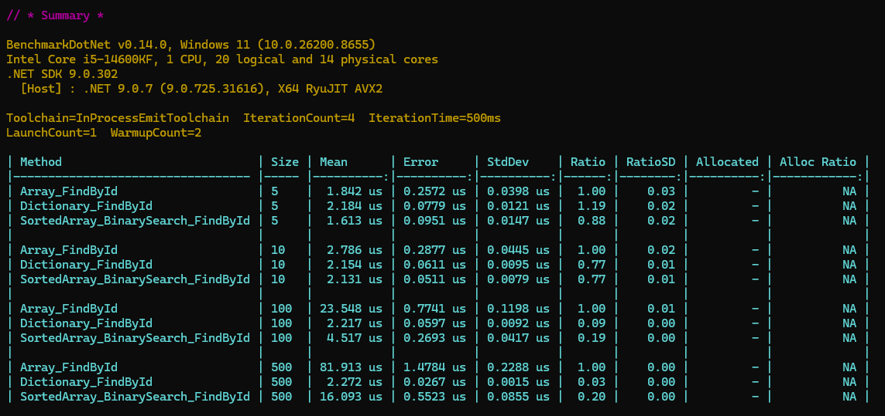
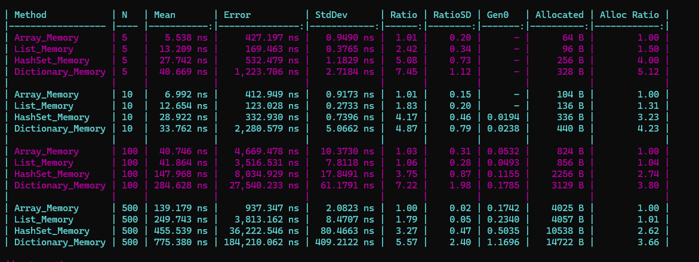

> 작성일: 2026.03.02

# List vs Dictionary Performance Test

게임 개발에서 자주 마주치는 질문이 있다.

> "이럴 땐 List가 빠를까, Dictionary가 빠를까?"  
> "Entity가 몇 개쯤 되면 Dictionary가 List보다 이득일까?"

최근 회사에서 정적 테이블(스킬, 아이템, 몬스터 등 변하지 않는 데이터) 처리를 하면서 이 질문이 구체적으로 떠올랐다. 읽기 성능이 중요한 상황에서, 실제로 어느 시점에 Dictionary가 List를 앞서는지 직접 벤치마크했다.

벤치마크 코드는 모두 공개되어 있다.  
[unity-lab / PerformanceTests](https://github.com/grobiann/unity-lab/tree/main/PerformanceTests)

---
## 벤치마크 시나리오
- C# (BenchmarkDotNet) 기준
- N개의 Entity(Id: 0~N-1) 컬렉션에서 랜덤으로 Id를 조회
- N: 5, 10, 100, 500
- **Array**: for + == 비교 (O(n))  
- **Dictionary**: TryGetValue (O(1))  
- **Array-BinarySearch**: Id 기준 정렬된 배열에서 BinarySearch 사용 (O(log n))

```csharp
public class Entity
{
    public int Id    { get; init; }
    public int Value { get; init; }
}
```

---

## 결과 요약


- **교차점은 N=10 전후**  
  N ≤ 5에서는 List가 더 빠르거나 비슷, N ≥ 10부터 Dictionary가 확실히 앞섬

### 특이사항

- 내부 반복 시행 횟수가 너무 작거나 너무 크면 벤치마크의 Iteration 시간이 오래 걸려 적당한 반복 횟수를 찾는 데에 시간이 걸렸다.  
Iteration 시행 횟수가 부족한 경우 오차범위가 커서 원하지 않는 결과가 나오곤 했다.  
N에 관계없이 Dictionary의 결과값이 비슷하게 나오도록 하는 것에 초점을 맞췄다.
- C++에서 포인터 순회를 하는 경우 더 빠를 수 있으니 그 부분을 고려하여 테스트해보았지만, C#과 비슷한 결과를 확인할 수 있었다.

---

## 메모리 할당 분석



benchmarkDotNet의 `[MemoryDiagnoser]`로 컨테이너별 힙 할당량을 측정했다. 모든 값은 **바이트(B)** 단위이며, 64비트 .NET 환경 기준이다.

### 측정 데이터

### 메모리 계산 공식

#### 1. Array (참조 타입)

```
메모리 = 배열 헤더 + Entity목록
       = 24 + 8N
```
- 24B: 객체 헤더 16B + (Length 4B + Pad 4B)
- 8N: Entity 참조 배열 (64비트 포인터)

#### 2. List

```
메모리 = Array + List 래퍼 오버헤드
       = (24 + 8N) + 32
```
``` 
internal T[] _items;   // 8B
internal int _size;    // 4B
internal int _version; // 4B
```
- 32B: 객체 헤더 16B + 내부 필드 (8B + 4B + 4B)

#### 3. HashSet

```
메모리 = Buckets + Entries + 내부 필드
       = (24 + 4N) + (24 + 16N) + (16 + 48)
       = 112 + 20N
```
```
private int[]? _buckets;    // 8B
private Entry[]? _entries;  // 8B
private int _count;         // 4B
private int _freeList;      // 4B
private int _freeCount;     // 4B
private int _version;       // 4B
private IEqualityComparer<T>? _comparer;  // 8B

#if TARGET_64BIT
private ulong _fastModMultiplier;  // 8B
#endif

private struct Entry
{
    public int HashCode;    // 4B
    public int Next;        // 4B
    public T Value;         // 8B
}
```
- 16N: Entry크기 (4B + 4B + 8B)
- 64B: 객체 헤더 16B + 내부 필드 (8B + 8B + 4B + 4B + 4B + 4B + 8B + (8B))
- 버킷 크기는 N보다 큰 가장 작은 소수

**예시 (N=100):**
- 역산: 2,256B = 112 + 20C → C = 107 (소수)
- 계산: 112 + 107 × 20 = 112 + 2,140 = **2,252B** ✓
- 실제값: 2,256B (차이 4B, 메모리 패딩)

#### 4. Dictionary
```
메모리 = Buckets + Entry + Keys + Values + 내부 필드
       = (24 + 4N) + (24 + 24N) + (80)
       = 128 + 28N
```
```
private int[]? _buckets;    // 8B
private Entry[]? _entries;  // 8B
private int _count;         // 4B
private int _freeList;      // 4B
private int _freeCount;     // 4B
private int _version;       // 4B
private IEqualityComparer<TKey>? _comparer;    // 8B
private KeyCollection? _keys;                  // 8B
private ValueCollection? _values;              // 8B

#if TARGET_64BIT
private ulong _fastModMultiplier;              // 8B
#endif

private struct Entry
{
    public uint hashCode;                     // 4B
    public int next;                          // 4B
    public TKey key;     // Key of entry      // 4B  (+ offset 4B)
    public TValue value; // Value of entry    // 8B
}
```
- 24N: Entry크기 (4B + 4B + 4B + 4B + 8B)
- 80B: 객체 헤더 16B + 내부 필드 (8B + 8B + 4B + 4B + 4B + 4B + 8B + 8B + 8B + (8B))
- 버킷 크기는 N보다 큰 가장 작은 소수

**예시 (N=100):**
- 역산: 3,128B = 128 + 28C → C = 107 (소수)
- 계산: 128 + 107 × 28 = 128 + 2,996 = **3,124B** ✓
- 실제값: 3,128B (차이 4B, 메모리 패딩)

### 메모리 할당량 정리
**Mac 64bit .NET 기준**

| 컨테이너 | 공식 | N=100 |
| --- | --- | --- |
| Array | 24 + 8N | 824B |
| List | 56 + 8N | 856B |
| HashSet | 112 + 20C | 2,252B |
| Dictionary | 128 + 28C | 3,124B |

*C = capacity (소수 기반 할당)*

---

## 정리
매번 추상적으로, 개념적으로만 알던 점들을 실제로 테스트하고 수치를 확인해보았다.<br>
대략 100개까지는 그래도 Array가 더 빠를 줄 알았지만 생각보다 Dictionary가 더 빠르다고 느껴졌다.<br>
테스트를 하는 과정에서 캐시 히트나, 해시 최적화, 랜덤 함수, 테스트 시간 오차 등 여러 가지로 시행착오를 겪었다.<br>
관련하여 기본 자료구조 클래스를 분석해보기도 하고, 새로운 것들을 볼 수 있는 기회가 되어서 많은 것을 배운 것 같다.<br>

메모리 관련 결과에 따르면 List 대신 Dictionary를 사용하는 것만으로도 메모리를 3-4배 더 사용하게 된다.<br>
테이블 데이터가 1만 개 있다고 하면 20B × 10,000 = 0.2MB의 차이가 날 것이다.<br>
게임이 오래 운영될수록 데이터는 쌓이게 되고, 정적 데이터 특성상 데이터를 잘 지우지는 않을 것이다.<br>
메모리가 부족한 모바일 환경을 생각한다면 무조건 속도가 빠른 Dictionary를 사용하는 게 아니라, 케이스별로 다르게 접근해야 할 것 같다. <br>
특히 iOS는 메모리가 부족하면 앱이 쉽게 종료되므로 매우 까다롭다. 기억으로는 약 800MB 정도면 종료된 것 같다.<br>

결국 데이터 수가 많아지면 성능이 안 좋거나 메모리 할당이 많아지는 문제가 있다. 이런 점을 보았을 때 데이터 클래스 구조 자체를 잘 정제하는 것이 제일 중요하지 않을까 싶다.

---

**벤치마크 코드:** [unity-lab / PerformanceTests](https://github.com/grobiann/unity-lab/tree/main/PerformanceTests)  
**측정 도구:** BenchmarkDotNet (C#), Google Benchmark (C++)  
**측정 환경:** Mac 64bit, .NET Core