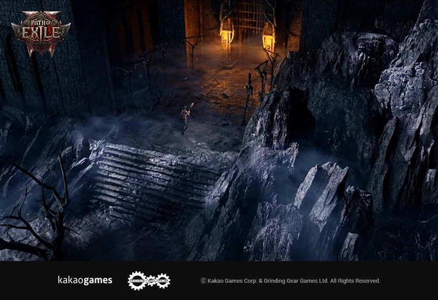
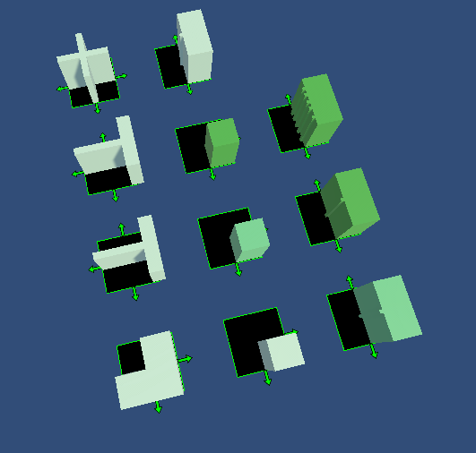
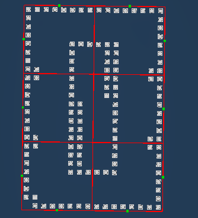
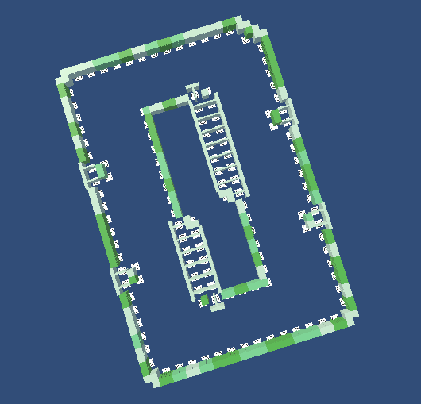
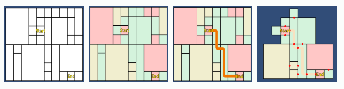
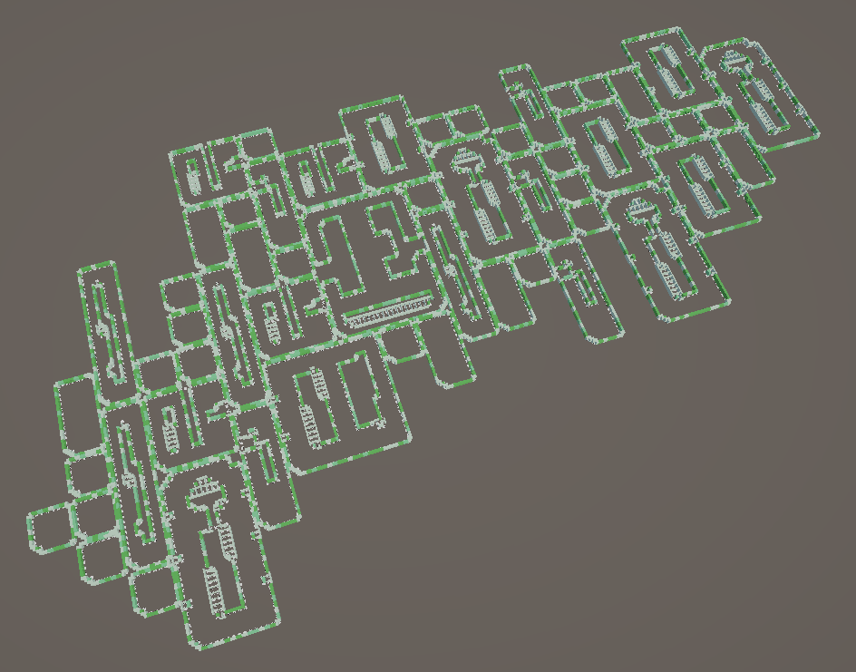

> 작성일: 2025.01.10

# 패스오브엑자일2 실내지역 던전생성

아래 내용은 poe공식 유튜브의 내용을 참고하여 제작하였습니다. 
https://www.youtube.com/watch?v=GcM9Ynfzll0

## 개요
게임 내 던전을 제작하는 방법에는 여러가지가 있습니다. 
절차적으로 던전을 생성하게 되면 매번 플레이시 새로운 느낌을 줄 수 있습니다. 
poe에서는 **타일에 대한 랜덤성**과, **던전의 진행경로에 대한 랜덤성**을 적용하였습니다. 

**타일 기반**으로 던전을 생성하면 적은 수의 리소스를 가지고도 다양한 던전을 생성할 수 있다는 장점이 있습니다. 그 외에도 동일한 머테리얼을 사용하여 드로우콜을 줄일 수 있는 점이나, 던전 제작시간이 빠른 점도 있습니다. 

poe에서는 던전의 진행 경로를 표현한 간단한 layout을 사용합니다. 
**layout 기반**으로 던전을 생성하게 되면, 던전에서 필요한 중요 오브젝트의 위치를 설정할 수 있고, 랜덤성이 줄어들어 밸런스를 관리하는데 용이합니다. 

던전의 구성은 아래와 같습니다. 
- **타일** : 정사각형 한칸
- **Room** : 1x1~NxM 크기의 직사각형. 여러개의 tile들로 이루어짐
- **던전** : 여러개 Room의 그룹

---

## 타일

타일에는 주변 타일과의 `연결관계`가 적용되어 있습니다. 
위 사진에서 초록색 화살표로 표현이 되었습니다. 
던전 타일에서는 주변의 벽 타일에 대한 정보를 담고 있습니다. 
위&아래 방향으로 `연결관계`가 있다는 말은 위&아래 방향으로 벽타일이 연결되어있고, 왼쪽&오른쪽 방향으로는 벽이 없다는 의미입니다. 

타일의 연결은 위,아래,왼쪽,오른쪽 총 4가지 방향이 있습니다. 각 타일에 대해 **회전시키거나 Flip**시킬 수 있으므로 총 `연결관계`의 경우의 수 4가지밖에 되지 않습니다. (위&아래, 위&오른쪽, 위&오른쪽&아래, 위&오른쪽&아래&왼쪽)

타일을 배치할때 특정한 타일의 '이름'이나 'key'로 생성되는것이 아니라, `연결관계`을 가지고 생성이 됩니다. 다시말하면 던전을 생성할때 같은 `연결관계`을 가진 타일중 어떤 것도 나올 수 있다는 의미입니다. 따라서 디자이너가 작업시에 이를 유의해야 겠습니다.

---

## Room

Room은 타일들로 이루어진 그룹입니다. 타일의 프리팹이 직접 적용된 것이 아니라 타일간 `연결관계`만을 정의하여, runtime에서 동적으로 타일 오브젝트를 생성합니다.

샘플 프로젝트에서는 unity의 tilemap2D를 이용하여 벽의 위치를 설정하였습니다. 위 사진은 2x3크기의 방 하나이고, 초록색 점은 다른 방과 연결될 수 있는 문의 위치입니다.
주변 방과의 관계에 따라 문은 생성되기도 하고 생성되지 않기도 합니다.

설정된 벽의 위치에 따라 랜덤한 타일을 생성하면 위 사진처럼 하나의 방이 완성됩니다.

타일을 회전하거나, Flip하는 과정에서 타일의 데이터를 일부 수정해야 했습니다. 바로 **Walkable 정보**입니다. 타일마다 walkable타일이 주변에 있는지, 어디에 위치하는지를 고려하여 회전하게 되었습니다.

---

## 던전
던전은 여러개의 크고다른 방을 배치하여 생성하게 됩니다. 
플레이어의 이동 경로에 랜덤성을 주기 위해 방을 배치하는 알고리즘을 제작하였습니다. 

>던전 생성 알고리즘
1. 던전의 크기를 설정합니다.
2. 시작 위치(1x1)와 종료 위치(1x1)를 설정합니다.
3. 나머지 여백에 NxM크기의 방을 랜덤하게 배치합니다.
4. 각 방을 통과하는 비용을 설정합니다.
5. 가장 비용이 적게 들도록 시작-종료지점 길을 찾습니다.
6. 경로에 있지 않은 나머지 방을 제거합니다.
7. 경로와 인접해 있는 방을 추가합니다.
8. 방과 방 사이에 문을 추가하여 이동가능하도록 합니다.

---

## 결과물

