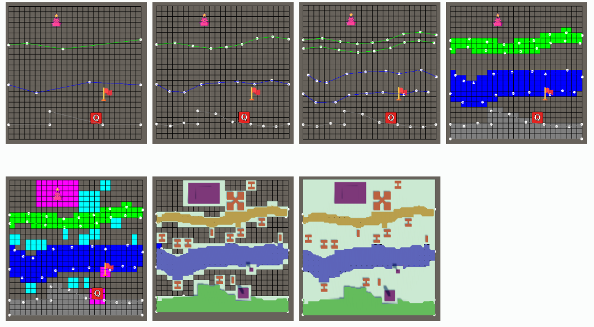
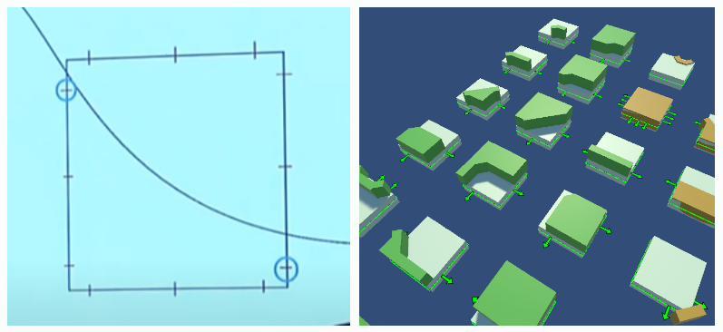
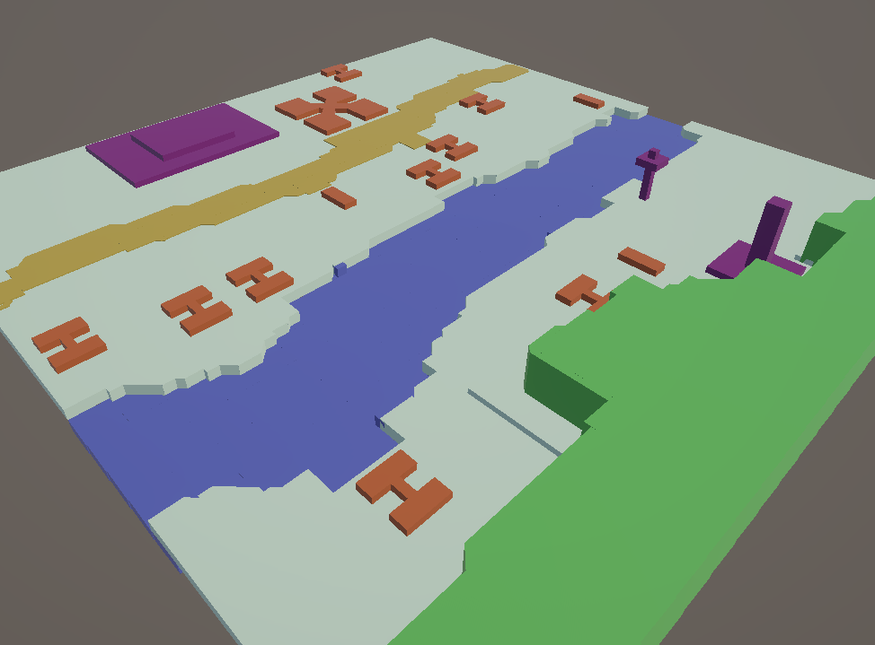

 
> 작성일: 2025.01.21

# 패스오브엑자일2 야외지역 던전생성

아래 내용은 poe공식 유튜브의 내용을 참고하여 제작하였습니다.
 https://www.youtube.com/watch?v=GcM9Ynfzll0
 https://www.youtube.com/watch?v=EXnoHTqO7TE

## 개요

야외지역 맵을 절차적으로 생성해보았습니다.

실내지역에서 설명한 것처럼, 절차적으로 던전을 생성하게 되면 매번 플레이시 새로운 느낌을 줄 수 있습니다. 
야외지역에서도 '방'이라는 개념을 사용하지만, 벽이 있는 어떤 공간이라기보다는 야외에 배치하는 장애물 정도로 생각하면 좋을 것 같습니다. 

---

## 던전 생성 단계
절차적으로 던전을 생성하는 과정에서, 여러 컨텐츠 위치를 관리하기 위해 사전에 정의된 레이아웃을 이용합니다. 
레이아웃에는 `길, 강, 벽, 언덕, 장애물, 퀘스트, 보스, 웨이포인트, 출입구` 등의 정보를 담고 있습니다. 

>
1. Path 꼬불꼬불하게 만들기 위해 중간에 점 추가
2. 너비가 있는 Path를 두 갈래 길로 분리
3. 경로의 뾰족하고 극단적인 부분을 부드럽게 완화 (Smooth)
4. Path가 지나가는 경로에 타일 타입 적용
5. 사전 정의된 방 배치 (퀘스트, 웨이포인트, 보스 등)
6. 빈 영역을 랜덤 방으로 채우기
7. 각 타일 정보에 따라 타일 오브젝트 생성

---

## Path
게임 내 오브젝트가 생성되는 일련의 위치 정보를 path라고 표현하였습니다. 
위 이미지에서는 초록색, 파란색, 회색의 선이 path입니다. 
path가 사용되는 예시로는 `길, 강, 벽, 언덕`이 있습니다. 
path는 `SinglePath, DoublePath, Outward` 타입이 있습니다. 
>SinglePath: 별다른 수정 없이 하나의 line만으로 오브젝트를 생성이 가능한 타입 
DoublePath: 너비가 존재하여, 알고리즘으로 두개의 line으로 분리하여 사용. 
Outward: 던전의 경계면과 이어지도록 처리하는 타입 

### path에 관련된 알고리즘 및 고민해볼 내용

**- 점과 점 사이에 임의의 간격과 폭을 설정하여 점 생성하기** 
점사이를 일정한 간격으로 나눈 후, 수직인 방향으로 일정 너비만큼 가감을 하여 처리하였습니다. 
부드럽게 연결이 되었지만 변동성이 크지 않아서, 다른 방법도 고민을 해야겠습니다. 

**- Path 상의 점을 특정 너비를 기준으로 두 개의 점으로 분리하기** 
새로운 점을 생성하는 과정에서 다른 path와 교차하게 되면 문제가 생길 수 있습니다. 
이러한 점을 해결하기 위해서는 각 점에 대해서 `Voronoi 공간분할`을 한 후, 각 공간 내에서만 새로운 점을 생성해야 합니다. 

**- Path의 극단적인 부분 완화하기 (Smooth)** 
여러개의 점을 추가하는 부분에서 이미 어느정도 부드러워져있어서 생략하였습니다. 
드라마틱한 레이아웃 배치나, 점 추가 알고리즘을 사용하는경우 완화 기능이 추가되어야 합니다. 
두 선분 사이 각도를 계산하여, 기존 점을 지우고 새로운 점을 추가하는 방향으로 구현할 수 있을 것입니다. 

**- Path의 방향성 처리하기** 
각 path에는 방향성이 있습니다. 예를들어 위 이미지에 적용된 회색의 벽타일은 위쪽 방향이 플레이 영역입니다. 
각 path에 대해 방향성을 계산해야 실제 오브젝트 생성시 올바르게 회전시킬 수 있습니다. 

**- Path간 교차지점 처리하기** 
두개의 path가 서로 교차하는 경우가 있습니다. 예를들면 도로-강이 교차하면 다리가 생성되어야 합니다. 
다리를 생성하는 단계를 생각해보겠습니다. 
1. 먼저 강을 너비를 적용하여 분할 
2. 길을 너비에 따라 분할하되, 강 위를 지나지 않도록 처리 
3. 강과 길이 교차하는 점에 다리 타일 생성 

이 과정에서 점을 이동하거나 생성할 때 voronoi 분할을 이용하여 점 생성 위치를 조심히 다루어야 합니다. 
이부분은 다소 복잡하여 실제 구현은 생략하였습니다.. 

---

## Room 
실내지역에서 사용된 Room을 확장하여 사용합니다. 
맵 내에 배치되는 `보스영역, 퀘스트존` 뿐 아니라, `인터렉터블(웨이포인트, 출입구, 던전입구 등)` 오브젝트 위치, `건물, 장애물` 등을 포함합니다. 
위치를 고정해 놓는 Fixed 타입과, 빈 공간에 랜덤하게 생성되는 Obstacle 타입으로 구분하였습니다. 
사전에 프리팹 형태로 제작해놓아 원하는대로 꾸미거나 표현할 수 있습니다. 

### room에 관련된 알고리즘 및 고민해볼 내용 
**- 사전 정의된 방의 위치 Validation** 
방의 위치를 랜덤하게 이동, 회전하여 플레이에 새로운 경험을 줄 수 있습니다. 
하지만 이 과정에서 기존에 적용된 path의 겹치게 되는 경우 문제가 생길 수 있습니다. 
예를들면 길 중간에 건물이 가로막고 있다거나, 강 위에 건물이 있을 수 있겠습니다. 

path와 겹치지 않는 위치로 시도를 하고, 여러번 시도했음에도 불구하고 가능한 위치가 없다면, 해당 seed는 실패로 처리합니다. 
seed가 실패했다는 것은 해당 seed로 던전을 생성할수 없다는 말로, 다른 seed를 이용해서 다시 던전 생성을 시도합니다. 

실제로 poe 공식 발표에서도 실패하는 seed가 존재한다고 합니다. 
알고리즘 소요시간이 20ms밖에 걸리지 않고 성공률도 90%가 넘으니 꽤 나쁘지 않은 선택입니다. 

---

## 타일

타일은 1x1크기의 한 격자입니다. 
타일 위에는 벽이 있거나 강, 언덕 등이 있습니다. 
각 타일을 이어서 커다란 지형을 만들어야 하기 때문에, 각 구조물이 부드럽게 연결되어야 합니다. 

부드러운 연결성을 위해 각 변마다 3개의 구간으로 나누어 총 12개의 구간`(L1~L3,R1~R3,U1~U3,B1~B3)`을 만들었습니다. 
한 곡선은 두개의 구간을 지나가게 되며, 그 종류의 수는 10가지입니다. 
이 10가지에 대응되는 타일을 만들어 놓고, **회전하거나 Flip**하여 배치하게 됩니다. 

>L1-R1, L1-R2, L1-R3, L2-R2, L1-U1, L1-U2, L1-U3, L2-U2, L2-U3, L3-U3

path의 타입이 DoublePath, Outward인 경우, 방향성도 고려하게 됩니다. 
방향성을 고려하게되면 위 10가지마다 반대 방향성을 처리하여 약 20여 가지의 타일을 만들어야 합니다. 

### 타일에 관련된 알고리즘 및 고민해볼 내용
**- 유니티의 Rule타일과 차이점**
유니티에는 주변 타일의 정보를 읽어서 상황에 맞는 타일을 표현해주는 Rule타일이 있습니다. Rule타일 사용시 한쪽 면에서 L1,L2,L3같이 세분화 할 수는 없고 타일 크기를 1/3로 줄이면 동일한 표현이 가능합니다.

타일의 크기는 **오브젝트 수, 메시 수**에 영향을 줄 수 있고, **크기가 클때 할수있는 여러 표현들**이 작아지면서 못하는 것들이 생기므로 게임 상황에 따라 선택하면 될 것입니다.

**- 선분이 지나가는 격자 좌표 계산하기** 
**- 선분이 지나가는 테두리 위치(L1~B3) 계산하기** 
**- 오브젝트 회전, Flip, 방향 처리** 

---

## 결과물

