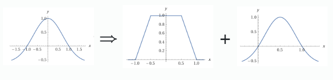
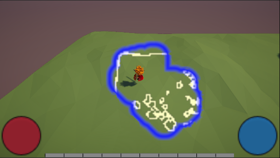
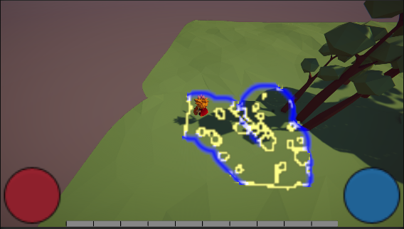
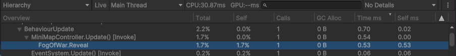
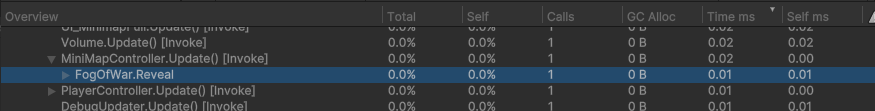

 
> 작성일: 2024.12.22

# 전장의 안개 (Fog of War)

전장의 안개는 아군 유닛의 시야가 닿지 않는 곳의 정보를 알려주지 않는 시스템을 말합니다.<br>
스타크래프트를 예로 들면 `정찰하지 않은 지역을 검정색` 으로, `정찰했지만 현재 유닛의 시야에 닿지 않는 지역을 회색`으로 처리되고 있는 시스템이 전장의 안개입니다.<br>


안개를 만드는데 고민해야 할 기능들은 아래와 같습니다.
>
1. 유닛 주위 반경으로 밝은 시야 처리 (시야 조건 적용)	
2. 이전에 방문한 지역(revealed) 처리
3. smoothing - 경계부분 처리
4. smoothing - 시야 변경에 따른 처리
5. 결과물 표현

---

### 다른 개발자들의 개발방법

 [[Rito15] 유니티 - 전장의 안개(Fog of War)](https://rito15.github.io/posts/fog-of-war/)
 
<div style="border: 1px solid #ccc; padding: 10px; border-radius: 5px;">
  - 시야 조건 : 장애물 검사 알고리즘<br>
  - revealed지역 처리 : opacity값 조정<br>
  - smoothing : 가우시안 분포<br>
  - 결과물 표현 : 카메라와 오브젝트 사이에 Fog Plane 생성  
</div>
<br>

[[NUDGIE DEV DIARY] Implementing Attractive Fog of War in Unity](https://andrewhungblog.wordpress.com/2018/06/23/implementing-fog-of-war-in-unity/)

<div style="border: 1px solid #ccc; padding: 10px; border-radius: 5px;">
  - 유닛 주위반경 처리 : <br>
  &nbsp; &nbsp; 캐릭터에 원형 mesh를 생성<br>
  &nbsp; &nbsp; 카메라의 ClearFlag를 Dont Clear로 설정<br>
  - 시야 조건 : 없음<br>
  - revealed지역 처리: 별도의 Texture생성(총 Fog Texture 2개)<br>
  - 결과물 표현 : unity의 projector 컴포넌트를 사용
</div>
<br>

[[Unity AssetStore] AOS Fog of War](https://assetstore.unity.com/packages/vfx/shaders/fullscreen-camera-effects/aos-fog-of-war-249249)

<div style="border: 1px solid #ccc; padding: 10px; border-radius: 5px;">
  - 시야 조건 : 지역별 Physics.BoxCast로 장애물 탐색<br>
  - revealed지역 처리 : opacity값 조정<br>
  - 결과물 표현 : 바닥에 Fog Plane생성, shader를 통해 오브젝트 위로 보이도록 처리
</div>
<br>

---
### 개발방법 선택

poe2는 다른 게임과 다른 시스템들이 몇가지 있었습니다.
- 게임 플레이영역(카메라)에 처리될 필요 없이 **UI에서만 사용**됩니다.
- 안개 영역은 검정색이 아니라 투명합니다.
- 한번 밝혀진 영역은 다시 어두워지지 않습니다.
- 안개의 기준이 되는 캐릭터가 하나입니다.

기존 프로젝트에서 맵의 전체를 Texture에 적용한 후, 미니맵에 그리는 방법을 사용했습니다.<br>
위의 차별점들과, 기존 적용방식을 고려하여 개발방법을 정리&선택 하였습니다.<br>

<div style="border: 1px solid #ccc; padding: 10px; border-radius: 5px;">
  1. 유닛 주위 반경으로 밝은 시야 처리 : <br>
  &nbsp; &nbsp; 맵 전체에 대한 <strong>Color[]배열</strong>을 이용하여 캐릭터 위치 기준으로 계산<br>
  2. revealed영역 : 미처리<br>
  3. smoothing(경계) : <strong>가우시안 분포</strong><br>
  4. smoothing(시야 변경) : 미처리<br>
  5. 결과물 표현 : <strong>shader에서 지도의 MainTex와 FogTex를 혼합</strong>하여 처리
</div>
<br>

---
### 기능 구현

```csharp
private Color32[] _fogPixels;

public void Reveal(Texture2D texture, Vector3 position)
{
    int centerX = (int)(position.x / _tileSize);
    int centerY = (int)(position.z / _tileSize);
    float gridRevealRadius = RevealRadius / _tileSize;
    float radiusSquared = gridRevealRadius * gridRevealRadius;

    for (int y = centerY - (int)gridRevealRadius; y <= centerY + (int)gridRevealRadius; y++)
    {
        for (int x = centerX - (int)gridRevealRadius; x <= centerX + (int)gridRevealRadius; x++)
        {
            int index = y * _textureSize + x;
            if (index < 0 || index >= _fogPixels.Length)
                continue;

            float dx = x - centerX;
            float dy = y - centerY;
            float distanceSquared = dx * dx + dy * dy;
            if (distanceSquared > radiusSquared)
                continue;

            // (1,0)과 (-1,0)을 지나도록 하는 alpha 계산식
            // clamp01(cof*(1-abs(x))
            // https://www.wolframalpha.com/input?i=min%28max%282*%281-abs%28x%29%29%2C0%29%2C1%29
            float xValue = Mathf.Sqrt(distanceSquared / radiusSquared);
            float alpha = Mathf.Clamp01(EdgeSharpness * (1 - xValue));
            byte opacity = (byte)(255 * (1.0f - alpha));
            byte prevOpacity = _fogPixels[index].a;

            if (opacity < prevOpacity)
            {
                _fogPixels[index] = new Color32(0, 0, 0, opacity);
            }
        }
    }

    texture.SetPixels32(_fogPixels);
    texture.Apply();
}
```

코드 내에서는 **경계선부분의 투명도 처리하는 함수식**이 있습니다.<br>
재미있는 점은 `clamp01(cof*(1-abs(x))` 함수를 썼다는 점입니다.<br>
x는 격자까지 거리, y는 안개의 투명도 입니다.<br>

처음 개발당시에는 가우시안 분포를 사용했었습니다.<br>
가우시안 분포를 사용하면, x가 커질수록 투명도가 부드럽게 낮아지는 장점이 있습니다.<br>
>
일반적으로 알려진 가우시안 분포는 $$f(x) = \frac{1}{\sqrt{2\pi\sigma^2}} e^{-\frac{(x - \mu)^2}{2\sigma^2}}$$ 입니다.<br>
여기에서는 거리에 대한 투명도 계산에 사용되므로, 
x의 범위를 -1.0에서 1.0까지, y의 범위를 0.0에서 1.0까지로 조정할 필요가 있습니다.
평행이동 및 스케일 변경을 통해 수정된  $$f(x) =(e^{-x^2} - 0.37) \times 1.59$$ 를 사용했습니다.<br>

하지만 poe2에서는 경계부분에 띠 형태로 표현되고, **띠 자체가 가우시안 분포**를 따르고 있습니다.<br>
따라서 fogPixels계산시에는 linear하게 처리하여 '경계부분이다' 라는것만 알게 하고, 셰이더 내에서 가우시안 분포를 이용해 처리하도록 하였습니다.<br>

 

```csharp
fixed4 frag (v2f i) : SV_Target
{
    half4 mainColor = tex2D(_MainTex, i.uv);
    half4 fogColor = tex2D(_FogTex, i.uv);

    if(fogColor.a > 0.0 && fogColor.a < 1.0)
    {
        // gausian distribution
        // (e^(-(2x-1)^2)-0.37)*1.59
        // https://www.wolframalpha.com/input?i=%28e%5E%28-%282x-1%29%5E2%29-0.37%29*1.59
        half fogAlpha = (exp(-pow(2*fogColor.a-1, 2))-0.37)*1.59;
        half4 fog = half4(0.0, 0.0, 1.0, fogAlpha*0.9);
        mainColor *= (1 - fogColor.a* 2);
        return mainColor + fog ;
    }

    mainColor.a = mainColor.a * (1 - fogColor.a);
    return mainColor;
}
```

---
### 결과물

<br>

---
## 전장의 안개 경계면 표현 심화

poe2의 미니맵을 유심히 살펴보면, <span style="color: purple;">**캐릭터가 걸을 수 있는 영역에만 안개**</span>가 보여집니다.<br>
반대로 말하면, 이동 불가능한 영역은 안개가 그려지지 않습니다.<br>

기존에 NavMesh를 이용하여 이동 가능 영역의 테두리를 추출하여, 미니맵에 그린 경험이 있었습니다.<br> [[Unity] PathOfExile 따라하기 - 미니맵 #1](https://velog.io/@grobiann0/PathOfExile-%EB%94%B0%EB%9D%BC%ED%95%98%EA%B8%B0-%EB%AF%B8%EB%8B%88%EB%A7%B5-1)

1. NavMesh.CalculateTriangulation()을 이용하여 **Mesh를 생성**한다.
2. 생성된 Mesh를 이용하여 MeshRenderer에 적용후 **카메라로 Render**한다.
3. 카메라의 결과물을 RenderTexture로 설정하고, **Texture2D로 변환**한다.
4. **셰이더에서 MovableTexture를 추가하여 계산**해준다.

```csharp
fixed4 frag (v2f i) : SV_Target
{
    half4 mainColor = tex2D(_MainTex, i.uv);
    half4 fogColor = tex2D(_FogTex, i.uv);
    half4 movableColor = tex2D(_MovableTex, i.uv);

    if (fogColor.a > 0.0 && fogColor.a < 1.0 && movableColor.r > 0)
    {
        // Gaussian distribution
        // (e^(-(2x-1)^2)-0.37)*1.59
        // https://www.wolframalpha.com/input?i=%28e%5E%28-%282x-1%29%5E2%29-0.37%29*1.59
        half fogAlpha = (exp(-pow(2 * fogColor.a - 1, 2)) - 0.37) * 1.59;
        half4 fog = half4(0.0, 0.0, 1.0, fogAlpha * 0.9);
        mainColor *= (1 - fogColor.a * 2);
        return mainColor + fog;
    }

    mainColor.a = mainColor.a * (1 - fogColor.a);
    return mainColor;
}
```

---
### 결과물 2



---
## 고민해볼 내용
### 1. 메모리 최적화
전장의 안개 셰이더에서는 fog텍스처, movable텍스처를 사용하고 있습니다.<br>
하지만 실제 계산과정에서는 float값 하나만 사용되는 것을 알 수 있습니다.<br>
이건 메모리 낭비로 볼 수 있습니다. <br>
어느정도 차이나는지 확인해보겠습니다.<br>

현재 사용하고 있는 텍스처의 크기는 128x128입니다.<br>
딱 보기에도 텍스처가 깨져보여, 화질을 높이기 위해 512x512로 수정하였습니다.<br>
512*512텍스처의 메모리 크기는 512*512*4byte=1MB입니다.<br>
텍스처는 총 3개 사용하고있으므로, **<span style="color: blue; font-weight: bold ">3MB정도를 차지</span>**합니다.<br>

pc게임 기준 3MB는 비교적 작은 용량으로 **크게 고려하지 않아도 되겠습니다.**


### 2. 속도 최적화
텍스처의 각 픽셀마다 색상값을 계산하는 Reveal 함수는 수많은 반복문을 돌아야 합니다. <br>특히 텍스처의 크기가 커질수록 영향이 커질 것으로 예상됩니다. 실제로 현재 속도를 프로파일링 해보니 **0.53ms**나 소요되었습니다.<br>


Reveal함수의 반복문은 gpu에서 병렬적으로 계산할 수 있습니다. 이때 사용되는 기능으로 컴퓨트 셰이더가 있습니다. 이부분은 `DirectX, OpenGEL 등의 지식`이 필요한데, 사전 지식이 깊지 않아서 이번 기회에 조금 더 알게 되었습니다.<br>
컴퓨트 셰이더를 사용하도록 변경 후 **<span style="color: blue; font-weight: bold ">0.01ms</span>**로 속도가 개선되었습니다.<br>




### 3. 텍스처 디버깅
일반적인 코드 디버깅은 IDE에서 break point를 설정하고 변수상태를 확인하는 방식으로 진행됩니다. 이번에 텍스처를 적극적으로 사용하면서 기존 디버깅 방식에 어려움을 느꼈습니다. 

> **텍스처 디버깅 방법**
> 1. 이미지 저장: break point 설정 후 텍스처를 png로 저장하는 함수를 호출해 결과물을 확인
> 2. 실시간 셰이더 수정: 셰이더 코드를 실시간으로 수정해 씬에 렌더링된 결과물을 바로 확인

셰이더 코드를 런타임에서 수정할 수 있다는 점은 큰 장점이었습니다. 하지만 두 가지 방법 모두 간단한 작업에서는 효과적이었지만, 보다 복잡한 작업에서는 한계가 있어보입니다. 이번 작업에서는 큰 문제가 없었지만, 앞으로 텍스처를 더 많이 사용하게 된다면 다른 디버깅 방법이나 툴에 대해 고민해볼 필요가 있겠습니다.

### 4. 용어 정리
**RenderTexture vs Texture2D**
텍스처 작업 중 `RenderTexture`와 `Texture2D`의 사용 방식이 혼동되었습니다.
특히 **컴퓨트셰이더**는 `RenderTexture`에만 적용된다는 점을 알게 되었습니다.

>
**RenderTexture**
- 주요 용도: 렌더링 결과를 저장하거나 실시간으로 변하는 텍스처 처리.
- 특징: 렌더링 파이프라인에 적용되며, 카메라의 결과물을 출력으로 사용할 수도 있음
- 업데이트 방식: 주로 GPU에서 렌더링을 통해 데이터를 실시간으로 업데이트

>
**Texture2D**
- 주요 용도: 고정된 이미지나 텍스처 데이터를 저장
- 특징: 주로 이미지 파일에서 로드하며, 주로 CPU에서 데이터 업데이트

텍스처 복사 방법
- Texture2D → RenderTexture: Graphics.Blit
- RenderTexture → Texture2D: Texture2D.ReadPixels