> 작성일: 2025.01.02

# 절차적 맵 생성(Procedural Level Generation)
절차적 맵 생성은 `알고리즘을 사용해 자동으로 지도를 생성하는 기술`입니다.<br>
개발자가 수작업으로 일일이 만드는 대신 알고리즘이 지도를 동적으로 생성하도록 합니다.<br>
이 방법은 무작위성을 활용하면서도 특정 규칙과 제약을 적용해 다양한 결과물을 만들어냅니다.<br>

## 장단점

> **장점**
> - 자동 생성: 알고리즘에 의해 지도가 자동으로 생성되므로, 개발자가 직접 설계하지 않아도 됩니다.
> - 다양성: 같은 알고리즘을 사용해도 다른 파라미터와 난수를 사용하면 다양한 결과물을 얻을 수 있습니다.
> - 재현 가능성: 특정 시드 값(seed)을 사용하면 동일한 지도를 반복적으로 생성할 수 있습니다.
> - 확장성: 대규모 세계나 복잡한 구조를 효율적으로 생성할 수 있습니다.

> **단점**
> - 품질 통제 어려움: 무작위성으로 인해 예측 불가능한 결과가 나올 수 있음.
> - 초기 개발 비용: 알고리즘을 설계하고 디버깅하는 데 시간이 걸릴 수 있음.
> - 사용 제한: 특정한 디자인 의도가 있는 경우에는 부적합할 수 있음.

특히 나무위키에는 이런 문구가 있습니다.

```
언뜻 보면 다양한 레벨이 나올 듯 싶지만, 특정 규칙에 따라 만들어지다 보니
개성은 고사하고 하면 할수록 레벨 패턴도 뻔히 보인다.
```
다양한 결과물과 편리한 개발이 보장될 것 같지만, 실제로는 조금 다를 수 있습니다.<br>
알고리즘을 너무 맹신하지 않고, <span style="color: red;">상황에 따라 알고리즘과 개발방법을 맞춰가는 것</span>이 좋겠습니다.<br>


---

## 활용 범위
절차적 맵 생성은 다양한 방식으로 활용될 수 있습니다.

1. 개발 속도 향상
	- 반복적인 오브젝트나 타일의 수동 배치를 줄여 작업시간을 단축합니다.
    - 원하는 seed를 선택하여 유저에게 정해진 맵을 제공합니다.    
2. 플레이어 경험 다양화
	- 유저가 매 플레이마다 랜덤하게 생성된 맵을 경험하여 새로움을 유지합니다.

**추가 활용 가능성**<br>
절차적 개발 이라는 것은 지도 생성 뿐 아니라 여러가지로 활용될 수 있습니다. 언리얼 엔진의 PCG (Procedural Content Generator)가 대표적인 예이고, No Man's Sky라는 게임에서는 동식물, 기후, 생태계를 절차적으로 생성하기도 하였습니다. 스토리나 내러티브도 절차적으로 만들 수도 있겠습니다.

---
## 알고리즘

### 1. 랜덤 워크(Random Walk)

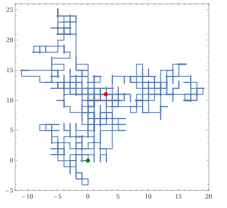

점을 무작위로 이동하며 길을 생성하는 알고리즘 입니다.

**진행 과정**
>  1. NxM 크기의 격자 판을 준비합니다. (2D 외에 다른 차원도 가능합니다.)
>  2. 격자 내에 시작할 위치를 선택합니다.
>  3. 해당 위치를 방문한 것으로 마킹합니다.
>  4. 랜덤한 이웃 위치로 한칸 이동하여 새로운 위치를 선택합니다. (좌,우,상,하)
>  5. 해당 위치가 마킹가능하다면(격자범위 내) 마킹합니다.
>  6. 4번으로 돌아가 종료조건이 될때까지 반복합니다. (ex. 이동 1000번)

**장점** : 간단하고 구현이 쉬움<br>
**단점** : 제어가 어려움, 무작위성이 높아 원하는 모양을 만들기 힘듦<br>

---
### 2. 셀룰러 오토마타(Cellular Automata)

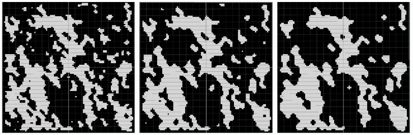

격자 형식의 맵에서 각 셀(cell)들이 주변에 있는 셀에 따라 자신의 상태를 변경하는 알고리즘입니다.

가장 마음에 드는 장점은 부드러움입니다.
Smoothing 단계를 반복할수록 극단적인 부분이 줄어들고, **`볼록한 형태가 만들어져 안정적인 모양을 형성`** 하게 됩니다. 
<br>이 방법은 동굴이나 방 구조의 맵에 유용할 것 같습니다.

>
**진행 과정**
  1. 초기 상태를 무작위로 설정합니다. (0,1중 랜덤으로 채우기)
  2. 각 셀의 상태를 주변 셀의 조건에 따라 갱신합니다. (Smoothing단계)
(주변 셀 중 값이 1인 개수가 5개 이상일 경우 1로, 그렇지 않으면 0으로 채웁니다.)
  3. 2번 단계를 여러번 반복하여 안정된 형태를 생성합니다.
  4. 복도 생성
  
**장점** : 자연스럽고 부드러운 유기적인 모양 생성.<br>
**단점** : <br>
\- 원하는 모양을 얻기 위해 적절한 규칙과 반복 횟수를 조정해야 함.<br>
\- 방의 위치나 개수를 제어하기 어려움<br>

---
### 3. 퍼린 노이즈(Perlin Noise)
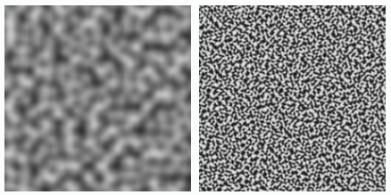

<p style="text-align: center; font-size: 14px; font-style: italic; color: #555;">
 왼쪽:<strong>Perlin Noise</strong>, 오른쪽: <strong>Simplex Noise</strong>
</p>

퍼린 노이즈는 연속적이고 부드러운 랜덤값을 생성하는 수학적 함수입니다.

>
**진행 과정**
1. 특정 크기의 노이즈 맵을 생성합니다.
2. 필요시 다중 노이즈를 결합하여 세부사항을 추가합니다.
3. 생성된 노이즈 값을 기반으로 맵을 표현합니다.

**장점** :<br>
\- 부드럽고 현실적인 지형 생성.<br>
\- 랜덤성을 유지하면서도 연속성을 제공.<br>
**단점**<br>
\- 수학적 계산이 필요하고, 단조로운 느낌을 줄 수 있음<br>

---

### 4. 델로네 삼각분할 (Delaunay triangulation)
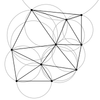

델로네 삼각분할이란 주어진 점들에 대해 최적의 삼각형 분할을 만드는 방법입니다.

>
**진행 과정**
1. 임의의 공간에 점을 여러 개 생성
3. 들로네 삼각분할로 점 연결
4. 최소 스패닝 트리(MST)로 루프 삭제
5. 복도 생성

**장점** : 규칙적이면서도 독특한 패턴 생성.
**단점** : 복잡한 연결을 추가로 구현해야 함.

---
### 5. BSP 트리(Binary Space Partitioning)

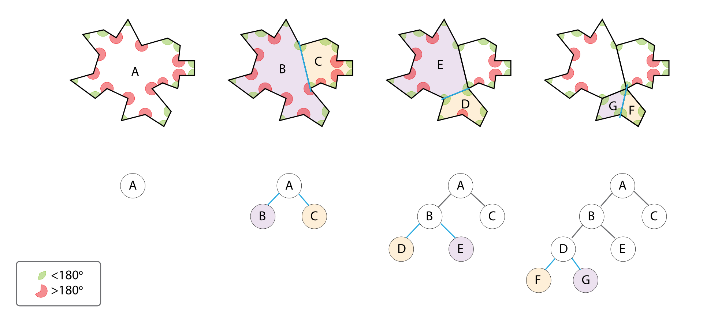

BSP는 공간을 이진 분할하며 방을 생성하고, 트리를 따라 길을 연결하는 방법입니다.

>
**진행 과정**
1. 임의의 방향(수직, 수평)과 임의의 위치를 선택해 공간을 둘로 분할한다.
2. 정해진 노드만큼 1번 과정을 반복한다.
3. 나누어진 공간에 맞춰 방을 생성한다.
4. 트리를 거슬러 올라가 방과 방을 연결한다. (방들 사이를 복도로 연결)


**장점**<br>
\- 던전 크기와 구조를 제어하기 쉬움.<br>
\- 방과 복도의 규칙적인 배치가 가능.<br>
**단점** : <br>
\- 구조가 다소 인위적일 수 있음.<br>

---

### 6. 파동함수 붕괴 알고리즘 (Wave Function Collapse)
<div align="center">
  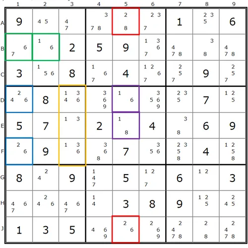
<p style="text-align: center; font-size: 14px; font-style: italic; color: #555;">
  출처: <a href="https://namu.wiki/w/%EC%8A%A4%EB%8F%84%EC%BF%A0/%EA%B3%B5%EB%9E%B5%EB%B2%95"> https://namu.wiki/w/%EC%8A%A4%EB%8F%84%EC%BF%A0/%EA%B3%B5%EB%9E%B5%EB%B2%95</a>
</p>
</div>

`주어진 패턴이나 규칙을 바탕으로 새로운 배열을 생성하는 알고리즘` 입니다. 
양자역학에서의 파동함수 붕괴 개념에서 영감을 얻었지만, 물리적인 의미는 없습니다. 
주로 퍼즐 문제나 컴퓨터 그래픽스에서 텍스처 생성, 구조적 패턴 생성 등에서 사용됩니다.

>
**진행 과정**
1. 셀의 상태, 연결 규칙을 정의합니다.(땅, 물, 나무)
2. 첫번째 셀을 선택하여, 상태를 확정합니다.
3. 셀의 연결 규칙에 따라 주변의 셀의 가능성을 갱신합니다.
4. 주변의 셀을 선택하여 상태를 확정합니다.
5. 모든 셀의 상태가 확정될때까지 3~4 단계를 반복합니다.


**장점** : <br>
\- 입력 패턴을 유지<br>
**단점** : <br>
\- 큰 맵에서는 전파 과정이 느릴 수 있음<br>
\- 복잡한 규칙에 의해 실패할 수 있음<br>

---

### 기타 곡선을 이용한 알고리즘
- **Z-Order Curves**
- **Hilbert Curves**

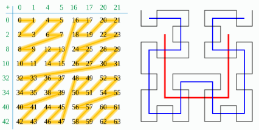

---

## 실제 게임에서의 활용

제가 즐겨하는 게임에서 사용되고있는 지도의 특징을 살펴보고, 어떤 절차적 알고리즘이 적용되었을지 보겠습니다.

<div style="border: 0px solid #000; padding: 10px; background-color: #f0f0f0;">
<span style="color:red;">! 아래 내용은 저의 주관적인 추측이므로 실제 구현과 다를 수 있습니다.</span>
</div>

### 1. 팩토리오
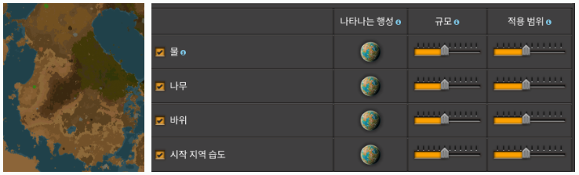

팩토리오는 실제 게임 내에 고저가 표현되지는 않지만, 지형 배치에 고저가 있는듯한 느낌을 줍니다.<br>
각 지형의 연결이 연속적이라는 부분에서 <span style="color:red;">Perlin Noise</span>를 이용하여 처리할 수 있겠습니다.<br>
특이한 것은 설정에서 물의 규모와 범위를 수정할 수 있다는 점입니다.<br>
물에 대한 인지를 수정하면 다른 지형은 그대로인 상태에서 물의 위치와 크기만 변하게 됩니다.<br>
이를 통해 **물에 대한 noise를 별도로 사용**하고 있는 것으로 생각할 수 있겠습니다.<br>
`규모는 noise의 scale`, `범위는 noise에서 물로 처리할 기준 숫자의 크기`로 생각됩니다.

1. 각 타일 위치에 따라 perlin noise값을 통해 땅 타일을 생성합니다.
2. 물의 noise 설정값에 따라 기존 타일을 수정합니다.
3. 그 외 습도, 나무 등 다른 기능들도 noise 설정 값에 따라 기존 타일을 수정합니다.

---

### 2. 어게인스트 더 스톰

**빈터 생성**
<div>
  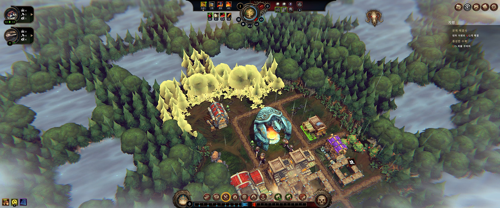
</div>

- 금지된 빈터: 시작지점으로부터 가장 먼거리에 주로 위치, 크기가 가장 큼
- 위험한 빈터: 시작지점으로부터 중간 거리에 주로 위치, 크기 중간
- 작은 빈터: 나머지 대부분의 영역은 작은 빈터로 채워짐

빈터는 3종류로 금지된, 위험한, 작은 빈터가 있습니다.<br>
빈터 사이사이는 나무로 채워지고, 빈터의 크기가 일정 범위 내에서 보장되어야 합니다.<br>
금지된 빈터의 개수는 벨런스 조정을 위해 관리할 수 있어야 합니다.<br>
따라서, 빈터의 위치에 해당하는 점을 배치할 때 금지된 빈터를 우선으로 처리하면 될 것으로 보입니다.

1. 맵의 범위 내에 빈터에 해당하는 점을 분포합니다.
	- 시작지점으로부터 꽤 떨어져있고, 다른 빈터와 겹치지 않는 위치에 점을 생성합니다. (금지된 빈터)
	- 마찬가지로 위험한 빈터의 위치를 찾아 점을 생성합니다.
	- 나머지 작은 빈터를 생성할 수 있는 위치에 점을 생성합니다.
2. <span style="color:red;">보로노이 다이어그램</span>을 이용해 지역을 구분합니다.
3. 경계선을 따라 나무를 생성합니다.

**월드맵**
<div>
  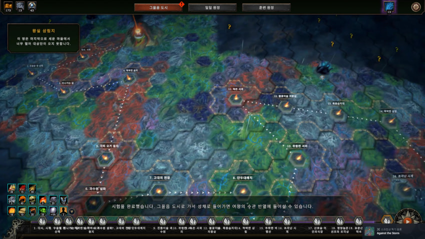
</div>

**같은 타입의 타일끼리 연결되는 점**, **인접 타일간 상호 규칙이 없는 점**이 있습니다.<br>
밸런스를 위해, 중심으로부터 떨어진 거리에 따라 타입의 weight가 수정될 수도 있겠습니다.<br>
이런 점을 고려했을때, <span style="color:red;">셀룰러 오토마타</span>를 사용하면 될 것 같습니다.

1. 중심으로부터 떨어진 거리에 따라 타일의 weight 설정
2. 각 타일의 weight에 따라 랜덤하게 타일 배치
3. 각 타일마다 인접한 타일의 영향을 받아 자신의 타입을 변경
4. 3번 과정을 여러번 반복 (smoothing)

---
### 3. 산소 미포함 (Oxygen Not Included)

**지도 생성**
<div>
	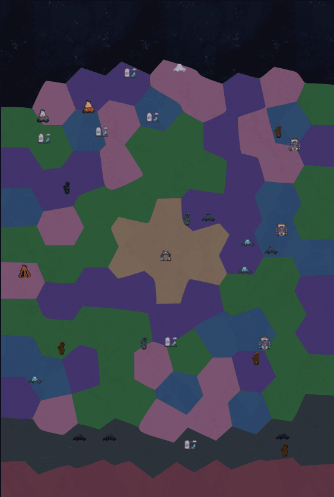
</div>

1. 맵 범위 내에 점을 균등하게 분포
2. 점마다 지형에 대한 정보 적용 (마그마 지역, 사암지역, 숲지역 등)
3. <span style="color:red;">보로노이 다이어그램</span>을 이용해 지형 구분
4. 경계선을 따라 격벽 생성

**타일 생성**
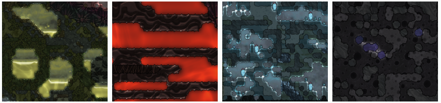


- 늡 지역: 중간중간 구멍이 뻥뻥
- 마그마 지역: 가로 형태의 타일 배치가 주로 나타남
- 툰드라 지역: 다소 복잡한 구멍이 뻥뻥
- 우주 지역: 여러 타일이 난잡하게 배치

`산소 미포함`에서는 지형마다 별도의 형태를 띄고 있습니다.<br>
특이점으로는 **같은 타입의 타일끼리 연결되는 점**, **인접 타일간 상호 규칙이 없는 점**이 있습니다.<br>
특히 구멍이 뚫린 영역을 보면 테두리가 부드러운 것이 smoothing을 처리하는 것으로 보입니다.<br>
이에 따라 <span style="color:red;">셀룰러 오토마타</span>를 기본 알고리즘으로 선택하되, 지형별로 변수값을 다르게 처리하면 될 것 같습니다.<br>

1. 각 타일의 weight에 따라 랜덤하게 타일 배치 (빈 타일 포함)
2. 각 타일마다 인접한 타일의 영향을 받아 자신의 타입을 변경
\- 인접한 가로 타일 영향도
\- 인접한 세로 타일 영향도
\- Smoothing 영향도
3. 2번 과정을 여러번 반복
4. 빈 타일은 물과 기체로 채우기

---

### 4. 마인크래프트

<div>
	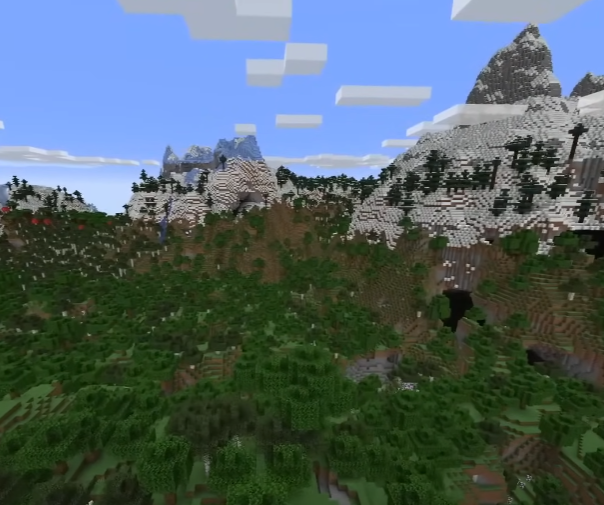
</div>

절차적 생성에서 빠질 수 없는 게임중 하나가 마인크래프트입니다.<br>
실제 세계처럼 고저가 있으므로, <span style="color:red;">Perlin noise</span>를 사용할 것입니다.<br>

마인크래프트에서는 산봉우리, 절벽, 동굴 등 드라마틱한 지형 표현과, 다양한 생물군계가 있습니다.<br>
이런 다양한 표현을 위해서는 노이즈를 여러개 사용하고, 일부 파라미터를 추가하여 조정해야 할 것입니다.<br>
특히 동굴같은경우 3d noise를 사용할 수 있겠습니다.<br>

---

### 5. 패스오브엑자일
<div>
	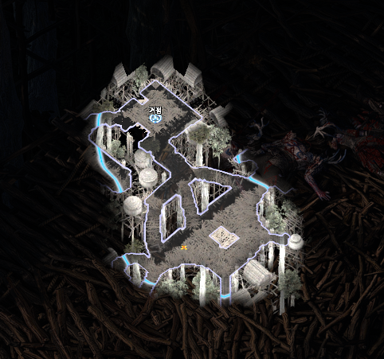
</div>

패스오브 엑자일에서는 매핑에서 매번 새로운 게임 플레이 경험을 주기 위해 절차적 생성을 이용하였습니다.<br>
게임의 특성상 지도의 레이아웃 자체가 바뀌게 되면, 벨런스 등에 문제가 갈 것입니다.<br>
따라서 전체적인 레이아웃은 유지한 상태에서, 세부적인 지형만 변경될 것입니다.<br>
예를들면 강이나 다리의 위치, 장애물 위치, 지도 가장자리(벽)의 울퉁불퉁한 형태 등등이 있습니다.<br>

**1. 길, 강같은 경로 표현** : 시작지점으로부터 목적지까지 동선을 직선이나 고정된 곡선이 아니라, 랜덤하게 꼬불꼬불 하도록 처리<br>
**2. 지도 내 빈 공간에 Room, 오브젝트 배치** : 맵 내에 사용되는 Room이나 오브젝트들을 맵 내 빈 공간에 랜덤하게 배치

---


## 느낀점
여러가지 게임들을 보면서 어떤 알고리즘으로 생성하는게 좋을까 여러 고민들을 하게 되었습니다.

고민중 한가지는 Fail Case에 대한 것이었습니다.<br>
파동함수 붕괴 알고리즘같은 인접타일간에 특정 조건이 있는경우가 특히 고민되었습니다.<br>
간단한 규칙으로 하려면 원하는 기능들을 추가하거나 확장성이 부족할 것 같고, 복잡한 규칙으로 하면 Fail이 빈번히 날 것 같았습니다. 제가 직접 해당 게임을 만들게 될 때도 꺼려지는 부분인 것 같습니다.

또 한가지는 생각보다 perlin noise에 대한 것이었습니다.<br>
기존에는 그냥 랜덤하게 타일을 배치하려면 perlin noise사용하면 된다고 생각했었는데, 실제로는 잘 맞지 않았습니다. perlin noise 특징이 연속적이라는 점인데, 오히려 이 부분이 랜덤 타일을 배치하기에는 단점으로 처리되기 때문이었습니다.

아직 실제로 절차적으로 개발한 경험이 적어 완전하지 못한 생각들이라고 생각합니다.<br>
이후에 하나씩 게임들을 따라 만들어보면서 생각한 설계가 맞을지, 개선점은 어떤것이 있을지 확인해 볼 예정입니다.

---
## Reference

Noveltech. Generating a 2D map using the Random Walk algorithm.<br>
&nbsp;&nbsp; https://www.noveltech.dev/procgen-random-walk<br>
Sebastian Lague. [Unity] Procedural Cave Generation (E01. Cellular Automata).<br>
&nbsp;&nbsp; https://www.youtube.com/watch?v=v7yyZZjF1z4<br>
바삭바삭. 절차적 맵생성.<br>
&nbsp;&nbsp; https://gall.dcinside.com/mgallery/board/view/?id=game_dev&no=40046<br>
Vazgriz. Procedurally Generated 3D Dungeons.<br>
&nbsp;&nbsp; https://www.youtube.com/watch?v=rBY2Dzej03A<br>
DV Gen. Procedural Generation with Wave Function Collapse and Model Synthesis | Unity Devlog.<br>
&nbsp;&nbsp; https://www.youtube.com/watch?v=zIRTOgfsjl0<br>
Henrik Kniberg. Mincecraft terrain generation in a nutshell.<br>
&nbsp;&nbsp; https://www.youtube.com/watch?v=CSa5O6knuwI<br>
GDC 2025. 6 Techniques for Leveraging AI in Content Generation.<br>
&nbsp;&nbsp; https://www.youtube.com/watch?v=priaBvs441Y&list=PLVmb_qp6XRcy8e-Lgs5SHzZezk1VPMvVl<br>
