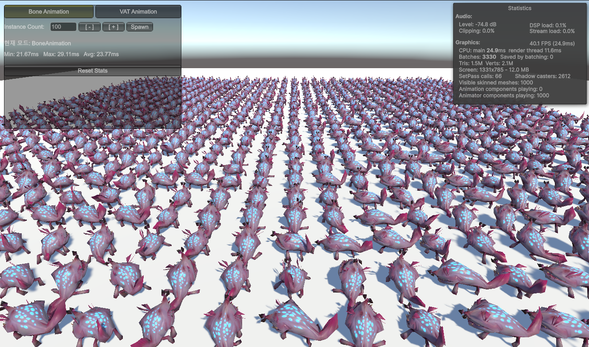
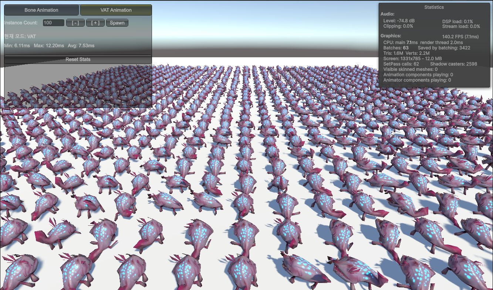

> 작성일: 2026.03.18

# Vertex Animation Texture

여러 게임들을 만들다보면 자연스럽게 캐릭터, 몬스터 수를 늘게 됩니다. 그런데 Unity의 기본 Skeletal 애니메이션으로는 캐릭터를 100개만 넘겨도 프레임이 눈에 띄게 떨어집니다. 찾아보다가 **VAT(Vertex Animation Texture)** 라는 기법을 알게 됐고, 직접 구현해보게 되었습니다.

## VAT란

스켈레탈 애니메이션은 CPU에서 본(Bone) 행렬을 계산하고 그걸 GPU에 넘기는 방식입니다.
CPU에서 부모-자식 관계로 된 행렬을 기반으로 본의 최종 위치를 선형적으로 계산하고, GPU는 전달받은 본 데이터를 기반으로 정점 위치를 계산하게 됩니다.

반면에 VAT는 발상이 특이했습니다. **애니메이션의 모든 프레임 정점 데이터를 미리 텍스처에 구워놓고**, 셰이더에서 시간에 따라 텍스처를 샘플링해 정점 위치를 결정합니다. 사전에 구워놓는 작업으로 인해 CPU가 할 일이 없어지게 됩니다.
CPU에서 행렬계산도 안하고, 정점 위치계산도 안해도 되기 때문에 **매우매우 빠른 연산속도** 라는 장점이 있습니다.

하지만 모든 애니메이션을 VAT로 처리하기에는 명확한 단점들이 있습니다.
1. 텍스쳐를 사용하므로, 메모리를 차지합니다. 특히 정점의 수와 애니메이션 클립 길이에 따라 메모리 양이 늘어나게 됩니다.
정점 1000개 * 60fps * 10초 = 600,000픽셀(32bit) = 2.4MB
2. **유연성**이 없습니다. 스켈레탈 애니메이션은 Animator Controller로 상태 전환, 블렌딩, IK 등 다양한 것들이 자동으로 적용되지만 VAT는 그런 개념이 아무것도 없습니다. 애니메이션이라면 보통 지원되는 두 클립사이 블렌딩도 직접 처리해야 합니다

이런 점들을 고려하면 수천명의 군중, 몬스터들을 처리하는 등 반복적이고 정해진 동작을 다수 실행하는 경우에 한정적으로 유용하게 사용할 수 있을 것입니다.

---

## 실제 구현 및 성능 비교
- 테스트 환경: Windows
- 인스턴스 수: 10,000개
  - Mesh Vertex: 600개
  - 애니메이션 클립 길이: 21s
  - 텍스쳐: 1024*2048 RGBA32

| 항목 | Bone Animation | VAT Animation |
|------|----------------|---------------|
| 스샷 |  |  |
| CPU | 24.9ms | 7.7ms |
| Batches | 3330 | 63 |
| 메모리 | 0 | 1024*2048 = 8MB |
| 평균 FPS (CPU Bound) | 40.1 | 129.5 |

---

## 직접 구현해보면서 겪은 것들
- **정점 수 줄이기 (8000개 → 500개)**  
테스트를 위해 유니티 3D 샘플킷을 이용했습니다. 정점수가 8500개인 메시를 그대로 사용했더니 텍스쳐 크기가 16384라는 어마어마한 숫자를 보게 되었습니다. Blender를 이용해 다시 export하여 실제로 VAT를 사용할만한 정점 수 정도로 변형하여 테스트 했습니다. 변형이 많이 이루어져서 가까이 보았을때 실루엣이 변형되는 아쉬움이 있었습니다.

- **VAT 생성 툴 제작 (메시 생성)**  
fbx로 추출한 메시로는 정점 인덱싱이 제대로 되지 않는 문제가 있어서 별도로 툴을 만들었습니다. Mesh와 함께 VAT텍스쳐, 일부 설정값들을 같이 추출하는 툴입니다. 새로 생성한 텍스쳐가 Compressed포맷으로 설정되어있어서 정보를 제대로 읽지 못하는 문제가 있었고, 추출시 RGBA32 형식으로 고정하도록하여 수정했습니다.

- **정점 위치 보간**  
처음에는 보간 없이 대충 정점을 읽기만 했었는데, 정점이 약간 끊기는 부분이 눈에 보였습니다. 정확한 정점위치 계산을 위해 두 정점 사이에 시간에 따른 보간 기능을 추가하여 자연스럽도록 만들었습니다.

- **라이팅 처리 - Normal 벡터도 함께 베이킹**  
위치 텍스처만 구웠더니 캐릭터에 라이트가 원본과 다르게 작동하고 있었습니다. 당연히 정점 위치가 셰이더에서 바뀌어도 Normal 벡터는 원본 메시 기준으로 고정돼 있기 때문입니다. VAT를 사용할때는 캐릭터 셰이더 단에서 라이팅을 다른방식으로 처리해야하지 않을까 싶습니다. Normal까지 베이킹한다면 메모리가 두 배나 차지하게 될 것입니다.

- **GPU 인스턴싱**  
성능비교를 하는중에, SetPassCall이 3330이 찍히는 것을 보았습니다. 인스턴스별로 텍스쳐를 개별로 넣어주고 있었는데, 텍스쳐에 대해서 설정할때 GPU 인스턴싱이 깨지는 것 같습니다. 공용 텍스쳐 처리를 하도록 해서 정상화 하였습니다.

- **UI에서는 별도처리 필요**  
유니티 Canvas기반 UGUI에서는 메시 범위같은 값들이 별도로 작동하고있습니다. 따라서 UI에서도 사용하고 싶은경우 별도의 처리를 통해 Mesh를 생성하고 실행해야 할 것입니다.